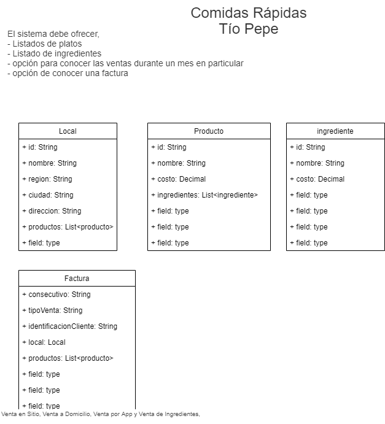
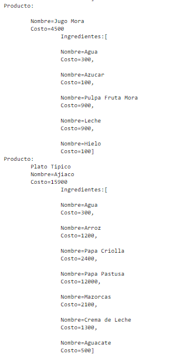
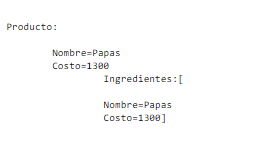

# Proyecto Base Implementando Clean Architecture

## Antes de Iniciar

Empezaremos por explicar los diferentes componentes del proyectos y partiremos de los componentes externos, continuando con los componentes core de negocio (dominio) y por último el inicio y configuración de la aplicación.

Lee el artículo [Clean Architecture & Aislando los detalles](https://medium.com/bancolombia-tech/clean-architecture-aislando-los-detalles-4f9530f35d7a)

# Arquitectura

## Domain

Es el módulo más interno de la arquitectura, pertenece a la capa del dominio y encapsula la lógica y reglas del negocio mediante modelos y entidades del dominio.

## Usecases

Este módulo gradle perteneciente a la capa del dominio, implementa los casos de uso del sistema, define lógica de aplicación y reacciona a las invocaciones desde el módulo de entry points, orquestando los flujos hacia el módulo de entities.

## Infrastructure

### Helpers

En el apartado de helpers tendremos utilidades generales para los Driven Adapters y Entry Points.

Estas utilidades no están arraigadas a objetos concretos, se realiza el uso de generics para modelar comportamientos
genéricos de los diferentes objetos de persistencia que puedan existir, este tipo de implementaciones se realizan
basadas en el patrón de diseño [Unit of Work y Repository](https://medium.com/@krzychukosobudzki/repository-design-pattern-bc490b256006)

Estas clases no puede existir solas y debe heredarse su compartimiento en los **Driven Adapters**

### Driven Adapters

Los driven adapter representan implementaciones externas a nuestro sistema, como lo son conexiones a servicios rest,
soap, bases de datos, lectura de archivos planos, y en concreto cualquier origen y fuente de datos con la que debamos
interactuar.

### Entry Points

Los entry points representan los puntos de entrada de la aplicación o el inicio de los flujos de negocio.

## Application

Este módulo es el más externo de la arquitectura, es el encargado de ensamblar los distintos módulos, resolver las dependencias y crear los beans de los casos de use (UseCases) de forma automática, inyectando en éstos instancias concretas de las dependencias declaradas. Además inicia la aplicación (es el único módulo del proyecto donde encontraremos la función public static void main(String[] args).

**Los beans de los casos de uso se disponibilizan automaticamente gracias a un '@ComponentScan' ubicado en esta capa.**

## Tienda de Tio Pipe
Se ha solicitado un programa informatico para la tienda de comidas rapidas Tio Pepe, esta tienda tiene locales en 6 ciudades del pais y en cada local ofrece al menos un plato de comida diferente de acuerdo a la región, también tiene ventas en todos ellos de Salchipapas, Hamburguesas, Wraps y Jugos.

Ademas de las Ventas en el Restaurante, realiza ventas a domicilio y venta de insumos para preparar los platos. El sistema debe ofrecer, ademas de los listados de platos e ingredientes (minimo 5 ingredientes por plato), las opciones de Venta en Sitio, Venta a Domicilio, Venta por App y Venta de Ingredientes, también una opción para conocer las ventas durante un mes en particular y una factura, que posee un consecutivo, la identificación del cliente, el tipo de Venta realizada y los productos vendidos.

#Casos de Uso

###Consultar Lista de Platos
Se expone servicio para la consulta de los platos de cada uno de los locales, para realizar la consulta se debe enviar el id con el que fue registrado el local y con este se retornan los Platos disponibles(Productos que son Platos)

- http://localhost:8080/api/listPlatos/{IdLocal}
  

###Consultar Lista de Insumos
Se expone servicio para la consulta de los insumos ofrecidos en cada uno de los locales, para realizar la consulta se debe enviar el id con el que fue registrado el local y con este se retorna la lista de insumos disponibles(Productos que son insumos)

-http://localhost:8080/api/listIngredientes/3
  

